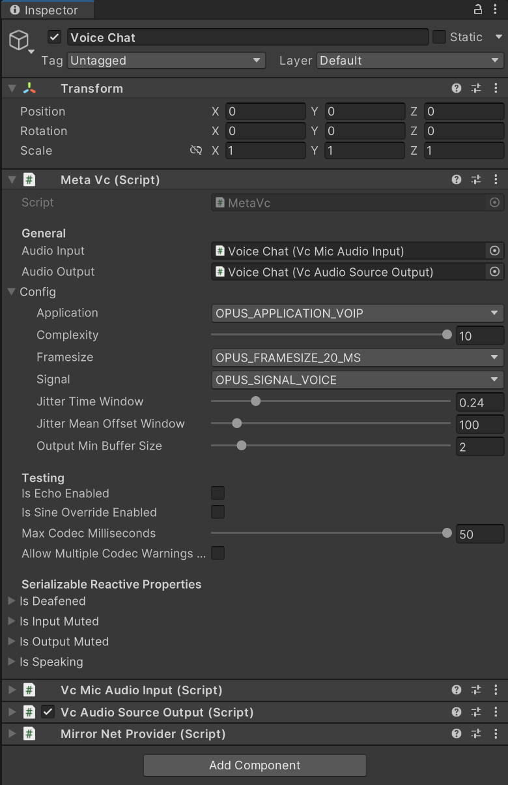
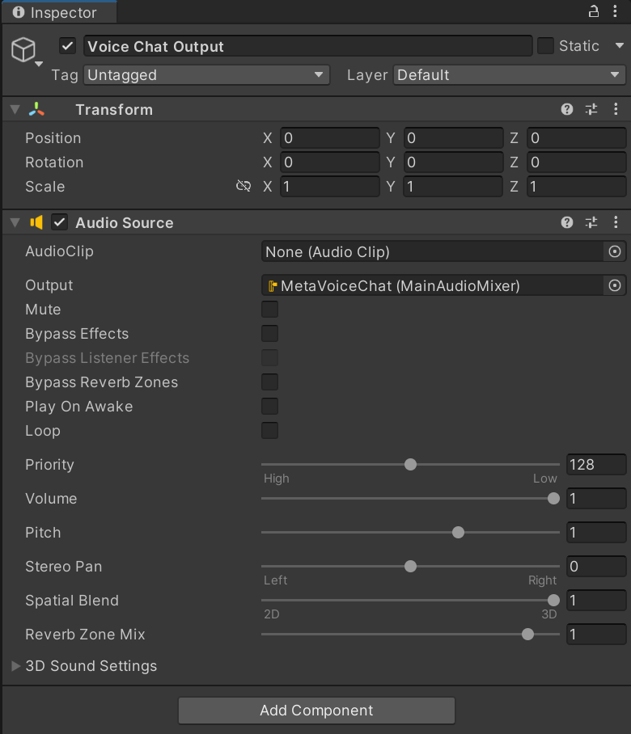
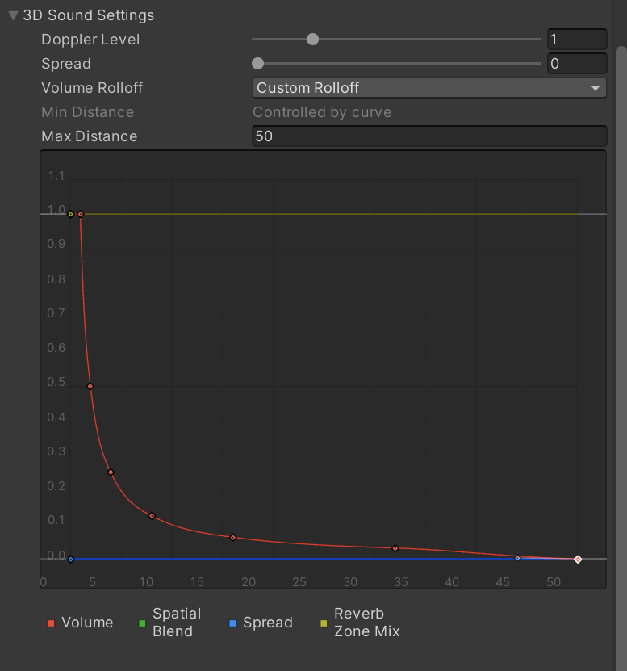

&ast; Currently, only Mirror is supported, however other libraries can easily be implemented by composing an agnostic MonoBehaviour and implementing a minimal interface — please feel free to contribute additional network provider implementations. Please make PRs with any of your changes or improvements if you feel they would be helpful to the public. Please create issues for things as you see fit.

## Table of Contents
- [Installation](#installation)
- [Information](#information)
- [Planned Features](#planned-features)
- [Tutorial](#tutorial)
- [Tips](#tips)
- [Public APIs](#public-apis)
- [Thank Yous](#thank-yous)
- [Network Providers](#network-providers)
- [Direct Improvements Over UniVoice](#direct-improvements-over-univoice)
- [Missing Things](#missing-things)
    - [Network Providers](#missing-network-providers)
    - [Features](#missing-features)
- [Extending Functionality](#extending-functionality)
    - [Network Provider](#how-do-i-write-a-network-provider-implementation)
    - [VcAudioInput](#how-do-i-write-a-vcaudioinput)
    - [VcAudioOutput](#how-do-i-write-a-vcaudiooutput)
    - [VcInputFilter](#how-do-i-write-a-vcinputfilter)
    - [VcOutputFilter](#how-do-i-write-a-vcoutputfilter)
- [Community Questions](#community-questions)
- [Games Made with MetaVoiceChat](#games-made-with-metavoicechat)
- [License](#license)

## Installation
1. On this page, click "<> Code" -> "Download ZIP".
2. Unzip the ZIP into your Unity "Assets" folder.
    - The "MetaVoiceChat" folder can be moved to anywhere inside of "Assets".
3. See [Tutorial](#tutorial) for additional steps.

## Information
- Simple
    - Default Unity microphone
    - No user code required and completely self-contained
    - No complicated cloud services required -- everything just works with your existing networking library
- Configurable
    - Exposed Opus settings (defaults in bold)
        - Application: <b>VOIP</b>, Audio, or Restricted Low-Delay
        - Complexity: 0-<b>10</b> (0 is less complex, while <b>10</b> is more complex)
        - Frame size: 10 ms, <b>20 ms</b>, or 40 ms
        - Signal: <b>Voice</b>, Music, or Auto
    - General settings
        - Jitter calculation time window size in seconds
        - Jitter mean time offset calculation window size in updates
        - Output min buffer size in fractional frames
    - VcAudioInput settings
        - First input filter
    - VcInputFilter settings
        - Next input filter
    - VcAudioOutput settings
        - First output filter
    - VcOutputFilter settings
        - Next output filter
    - VcAudioSourceOutput settings
        - Audio source
        - Buffer frame lifetime in seconds
        - Buffer max negative latency in seconds
        - Pitch proportional gain in percent per second of latency error
        - Pitch max correction in percent
    - Default input is the Unity microphone
    - Default output is a Unity Audio Source
- Functional
    - Functionality and reactive properties with events for
        - Speaking
        - Deafening yourself
        - Input muting yourself
        - Output muting others
    - Unity microphone wrapper
    - Circular audio clip
    - RMS jitter calculation utility within a time window and mean time offset window using a mean deviation method
    - Thread-safe fixed length array pool utility
    - Serializable reactive property utility
    - Frame stopwatch utility
- Modular
    - Abstract VcAudioInput and VcAudioOutput classes
    - Abstract VcInputFilter and VcOutputFilter pipelines
- Testable
    - Echo mode to playback your own voice
    - Sine wave voice override mode
    - Max codec milliseconds before warning
        - These warnings are limited to once per frame by default
- Details
    - No memory garbage created at runtime using pooled data buffers
    - Constants
        - 16kHz sampling frequency
        - Wideband Opus bandwidth
        - SILK Opus mode
        - Single audio channel
        - 16-bit audio
        - 1 second input and output audio clip loop time
    - Average latency is ~250-300 ms with default settings (Unity's high-latency microphone is to blame for ~200 ms of this)
    - Dynamic buffer latency compensation using a latency error P-controller with RMS jitter, sender FPS, server/host FPS, and receiver FPS adjustments
- Opus features
    - Variable bitrate encoding
    - [Opus Official Website](https://opus-codec.org/)

## Planned Features
- Voice activation detection and latching
- Push to talk
- UI for settings and indicators with hooks and an official implementation that saves to PlayerPrefs
- Abstract selection system for configuring voice chat settings for particular clients the local player chooses

## Tutorial
1. Ensure you have properly completed the [installation](#installation) steps.
2. Create a "Voice Chat" or similarly named game object as a child of your networked player game object or other networked game object that you would like to have networked audio on.
3. Add the "MetaVc" component to the "Voice Chat" game object.
4. Add your desired audio input, such as "VcMicAudioInput" to the game object.
5. Likewise, add your desired audio output, such as "VcAudioSourceOutput" to the game object.
6. Connect your audio input and output to the "MetaVc" fields.
7. Lastly, add your desired network provider, such as "MirrorNetProvider" to the game object.
8. It should look something like this now: 
    - All of these defaults should be okay, however you may want to decrease the "Complexity" field for games with many concurrently connected users or lower-end devices.
    - Remember to use "Max Codec Milliseconds" to ensure that your complexity value is not too high for your game.
        - Note: The codec performs sluggishly in bursts, so set this value higher than your desired frame period and ensure warnings are not being spammed and then increase it back to the max to disable it when you are done testing.
    - Use "Allow Multiple Codec Warnings Per Frame" to ensure you get the total frame time used by the codec when there are warnings.
9. Create a "Voice Chat Output" or similarly named Audio Source game object as a child of the networked game object. If this is a player, it should be in the mouth area.
10. Configure the output Audio Source
    - "Output" = the voice chat audio mixer group (optional)
    - "Play On Awake" = false
    - "Loop" is set to true internally, so don't worry
    - "Spacial Blend" = 1 for 3D proximity chat and 0 for normal voice chat
    - "3D Sound Settings"
        - "Doppler Level" is set to 0 internally, so don't worry (It must be 0 because of how Unity implements this)
        - "Max Distance" = ~50 meters or whatever you think is best
        - Ensure the volume roll-off curve's last data point has a volume of zero.
    - Your general settings should look like this: 
    - Your 3D sound settings should look like this: 
11. Connect your voice chat output Audio Source to the "Audio Source" field under the "Vc Audio Source Output" component.
12. Connect the "Meta Vc" fields under your audio input and output to the "Meta Vc" sibling component.
13. At this point, the "Voice Chat" game object should look like this: 
14. You are done!!! See [tips](#tips) below for more.

## Tips
- Change Project Settings/Audio/DSP Buffer Size from "Best performance" to "Best latency"
- Apply input and output filters to audio inputs and outputs by using the first filter fields
- Chain together input and output filters to form pipelines by using the next filter fields
- A frame size of 10 ms is useful for achieving lower latency on higher-end devices with high network send rates for all users. A frame size of 40 ms is useful for optimization on lower-end devices and networks, but this negatively impacts ear-to-ear latency and worsens the audio quality when packets are dropped. A frame size of 20 ms is a good balance.

## Public APIs
```cs
public class VcMic : IDisposable
{
    public bool IsRecording { get; }
    public AudioClip AudioClip { get; }
    public IReadOnlyList<string> Devices { get; }
    public int CurrentDeviceIndex { get; }
    public int CurrentDeviceName { get; }

    // zero-based frame index, samples
    public event Action<int, float[]> OnFrameReady;

    public void SetDeviceIndex(int index) { }
    public void StartRecording() { }
    public void StopRecording() { }
    public void Dispose() { }
}
```

## Thank Yous

### A massive thank you to [Vatsal Ambastha](https://github.com/adrenak) and his projects [UniVoice](https://github.com/adrenak/univoice) and [UniMic](https://github.com/adrenak/unimic) that were heavily referenced when starting this project in late 2023.

### Another thank you to [Concentus: Opus for Everyone](https://github.com/lostromb/concentus) for their native C# implementation of Opus that makes it extremely easy to add Opus to projects like this.

## Network Providers
- [Mirror](https://github.com/MirrorNetworking/Mirror)

## Direct Improvements Over [UniVoice](https://github.com/adrenak/univoice)
- Fixed memory leak
- Many playback algorithm improvements
- Dynamic audio buffer latency compensation
- Lower latency

## Missing Things

### Missing Network Providers
- [Netcode for GameObjects](https://docs-multiplayer.unity3d.com/netcode/current/about/)
- [LiteNetLib](https://github.com/RevenantX/LiteNetLib)
- [LiteEntitySystem](https://github.com/RevenantX/LiteEntitySystem)
- [Fish-Net](https://fish-networking.gitbook.io/docs)
- [Dark Rift 2](https://github.com/DarkRiftNetworking/DarkRift)
- [Unity WebRTC](https://github.com/Unity-Technologies/com.unity.webrtc)
- [Photon Unity Networking 2](https://www.photonengine.com/pun)

### Missing Features
- Example scene
- Configurable sampling rates
- Multithreading for Opus
- Compared to [Dissonance Voice Chat](https://assetstore.unity.com/packages/tools/audio/dissonance-voice-chat-70078)
    - Audio preprocessing
        - Noise suppression
        - Dynamic range compression
        - Automatic gain control
    - Audio postprocessing
        - Acoustic echo cancellation
        - Soft clipping
        - Soft channel fade
    - Certain Opus features
        - Forward error correction
    - Multiple chat rooms

## Extending Functionality

### How do I write a network provider implementation?
- TODO

### How do I write a VcAudioInput?
- Ideas for you: transmit an audio file or in-game audio
- TODO

### How do I write a VcAudioOutput?
- Ideas for you: save audio or do speech-to-text
- TODO

### How do I write a VcInputFilter?
- TODO

### How do I write a VcOutputFilter?
- TODO

## Community Questions
- Should code fail without throwing exceptions? Should silent failure be an option? E.g. VcMicAudioInput and VcAudioClip may throw.
- How can vulnerabilities be found and compensated for?

## Games Made with MetaVoiceChat
- My own WIP game "Bomb Bois". I am still getting the public Steam page up.

## License
- This project is licensed under the [MIT License](LICENSE)
- You are technically permitted to sell this project exactly as it is under the MIT license, but please don't. Just share this project for free with others that would like to use it.
- Now go and make great games, whether for profit or free, using this! Please share links to your projects -- I would love to see what you all make!

## To-Do

## Advertising
- Discord
    - Mirror
    - LiteNetLib
    - Code Monkey
- Reddit
    - Unity3D

## Ideas
- Abstract text chat implementation with UI
